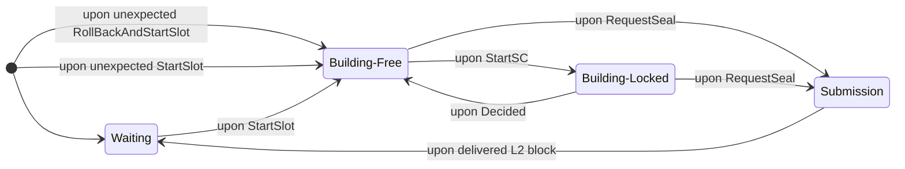
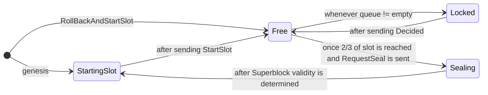

# Superblock Construction Protocol (SBCP) <!-- omit from toc -->

This document describes the protocol from the beginning of the slot until a superblock is published.

## Table of Contents <!-- omit from toc -->

- [Block Time](#block-time)
- [System Model](#system-model)
- [Messages](#messages)
- [Protocol](#protocol)
    - [Sequencer](#sequencer)
    - [Shared Publisher (SP)](#shared-publisher-sp)
    - [Recovery](#recovery)
- [Fault Tolerance](#fault-tolerance)
- [Parallelism](#parallelism)
- [Future work](#future-work)

## Block Time

What does the block time impact?

- **Protocol Throughput, Latency, and Cost**: It shoud be long enough such that the sequencers and the shared publisher
  have enough time to: run the SC protocol for many cross-chain transactions, build L2 blocks with local transactions,
  disseminate the L2 blocks, build the superblock, validate it, and publish to L1. A higher block time allows more
  cross-chain transactions to be included per superblock construction effort.
- **Publishing Cost**: Each superblock publishment is an L1 transaction that requires gas payment from the shared
  publisher. Therefore, too frequent superblocks may become expensive for the SP.
- **Finality**: For an L1 block, it takes around 12.8 minutes from its construction until it's finalized in Ethereum.
  Thus, for an L2 block, its takes its construction time plus ~12.8 minutes. While short block times such as 1 second
  don't change much finality, longer block times may represent a significant delay compared to current standards.
- **Soft Confirmation**: Rollups may broadcast block fragments in case it wants to expose some state advancement more
  frequently. However, even with a valid block fragment, it's not guaranteed that such a block will eventually be part
  of a valid Superblock, as it depends on other sequencers and on the SP. A higher level of certainty is provided when a
  valid Superblock is constructed. So, while block fragments can advertise state advancements with any frequency,
  independently from the block time, soft confirmations on the Superblock should depend on it.
- **Based**: If the SP aims to be a *based* role, it's important to comply with Ethereum's 12 seconds slot time.

Based on the above considerations, the selected block time is **12 seconds**.

## System Model

The system model is the same as described for the [SC protocol](./synchronous_composability_protocol.md#system-model),
with the exception that the set of rollups is considered to be dynamic.

The system tolerates crash fault from sequencers, though the shared publisher can't crash to guarantee termination.
This is explored more deeply in the [Fault Tolerance](#fault-tolerance) section.

## Messages

```protobuf
syntax = "proto3";

// Auxiliary
message L2BlockRequest {
  bytes ChainID = 1;
  uint64 BlockNumber = 2;
  bytes ParentHash = 3;
}

// Shared Publisher
message StartSlot {
  uint64 Slot = 1;  // Current slot
  uint64 NextSuperblockNumber = 2;  // Superblock number the SP currently aims to produce during this slot
  bytes LastSuperblockHash = 3;
  repeated L2BlockRequest L2BlocksRequest = 4;
}

message RequestSeal {
  uint64 Slot = 1;
  repeated bytes IncludedxTs = 2;
}

message RollBackAndStartSlot {
  repeated L2BlockRequest L2BlocksRequest = 1;
  uint64 CurrentSlot = 2;
  uint64 NextSuperblockNumber = 3;
  bytes LastSuperblockHash = 4;
}

// Sequencer
message L2Block {
  uint64 Slot = 1;
  bytes ChainID = 2;
  uint64 BlockNumber = 3;
  bytes BlockHash = 4;
  bytes ParentBlockHash = 5;
  repeated bytes IncludedxTs = 6;
  bytes Block = 7;
}
```

Where `Block.Block` is an
encoded [Ethereum block](https://github.com/ethereum/go-ethereum/blob/master/core/types/block.go).

Check the [SCP document](./synchronous_composability_protocol.md#messages) for its list of messages.

## Protocol

### Sequencer

We describe the sequencer as a state machine.



The sequencer holds the following state variables.

```py
Constants:
OwnChainID  # ID of the rollup this sequencer is responsible for

State
Variables:
blocks: map[blockNumber] → L2Block  # Stored L2 blocks
state ← Waiting  # Enum object of the possible states described below
draft: {  # Current block being built
    l2BlockNumber ← 0
l2ParentHash ← ⊥
slot ← 0
superblockNumber ← 0
txs ← []
includedxTs ← []
scpInstances: map[xTid] → SCPInstance
}
```

**Initialization**

A rollup registers to the registry contract defining a genesis L2 block, its sequencer public key and endpoint, and its
starting slot.
The sequencer initializes its [state](#state) in the `Waiting` state.

**`Waiting`**

In this state, the sequencer waits for the SP to indicate, through a `StartSlot` message, that a new slot should be
started.
The `StartSlot` message indicates the new slot number, the next Superblock number, the parent Superblock hash, and what
L2 blocks should be built by each rollup.
The sequencer then switches to the `Building-Free` state and adds necessary top-of-block transactions such as
`Mailbox.clean`.

Actually, because the shared publisher can possibly crash and because Superblocks may rollback, the `StartSlot` and
`RollBackAndStartSlot` (which has the same purpose) messages should always be processed in the same manner independently
of the current sequencer state, i.e. it doesn't need to be in the `Waiting` state.

```py
Upon
receiving
StartSlot or RollBackAndStartSlot as msg:

# Check if message is for a newer slot
if draft.slot >= msg.Slot:
    return

req ← Find(msg.L2BlocksRequest
where
req.ChainID == OwnChainID)
if req == ⊥:
    return

draft.slot ← msg.Slot
draft.superblockNumber ← msg.NextSuperblockNumber
draft.l2BlockNumber ← req.BlockNumber
draft.l2ParentHash ← req.ParentHash
draft.txs ← []
draft.includedxTs ← []
draft.scpInstances.clear()

draft.txs += StandardTopOfBlockTxs()

state ← Building - Free
```

**`Building-Free`**

When in the `Building-Free` state, the sequencer adds local transactions to its L2 block.

```py
Upon
receiving
a
local
transaction in the
Building - Free
state:

if validTransaction(tx):
    draft.txs.append(tx)
```

Once a `StartSC` message is received from the SP, it changes to the `Building-Locked` state.
The `StartSC` message contains both the cross-chain transaction request as well as a slot-sequence number for ordering
purposes.

```py
Upon
receiving
StartSC in the
Building - Free
state:

if StartSC.Slot != draft.slot:
    return

lastInstance ← draft.scpInstances.Top()
if lastInstance.HasDecided == False:
    return
if StartSC.xTSequenceNumber != lastInstance.SequenceNumber + 1:
    return

state ← Building - Locked

draft.scpInstances.append(NewSCPInstance(StartSC))
```

Notice that if the next `StartSC` is received before the `Decided` message for the current instance, then the `StartSC`
won't be processed though it shouldn't be discarded. The implementation should guarantee the appropriate delivery of
messages, in order, to the application.

Once a `RequestSeal` message is received from the SP, the sequencer should switch to the `Submission` state.
The message indicates what cross-chain transactions should be included, and the sequencer should have agree on such list
according to its local state.

```py
Upon
receiving
RequestSeal in the
Building - Free
state:

if RequestSeal.Slot != draft.slot:
    return

if not (includedxTs(draft.scpInstances) ⊆ RequestSeal.IncludedxTs):
    return

state ← Submission
SubmissionPhase()
```

The `SubmissionPhase()` function will be described below.

> [!NOTE]
> During any state, the sequencer may receive cross-chain transaction requests directly from users.
> Once a request is received, the sequencer does not immediately start it (as it was in the PoC). Rather, it sends the
> request to the shared publisher who will initiate it with a `StartSC` message.

**`Building-Locked`**

The sequencer switches to the `Building-Locked` state due to a `StartSC` message.
During such state, the [synchronous composability protocol](./synchronous_composability_protocol.md) is executed and no
local transactions can be included.

SCP messages should be redirected to the appropriate SCP instance.

```py
Upon
receiving
CIRCMessage in the
Building - Locked
state:

if CIRCMessage.Slot != draft.slot:
    return

lastInstance ← draft.scpInstances.Top()
if lastInstance.xTid != CIRCMessage.xTid:
    return

lastInstance.Process(CIRCMessage)
```

Once a `Decided` message is received for the ongoing SCP instance, the sequencer should atomically include or not the
collection of the cross-chain transaction along with extra transactions for populating the mailbox with CIRC messages,
depending on the decision.
After the `Decided` message is processed, it switchs back to the `Building-Free` state.

```py
Upon
receiving
Decided in the
Building - Locked
state:

if Decided.Slot != draft.slot:
    return

lastInstance ← draft.scpInstances.Top()
if lastInstance.xTid != Decided.xTid:
    return

newTxs ← lastInstance.Process(Decided)
draft.txs.append(newTxs...)
```

A `RequestSeal` message may also be received in the `Building-Locked` state.
This means that the `Decided` message got delayed and wasn't already received.
However, the sequencer isn't locked in this state as the `RequestSeal` message contains the list of all included
cross-chain transactions, and, thus, it can infer it the current should be included or not.

```py
Upon
receiving
RequestSeal in the
Building - Locked
state:

if RequestSeal.Slot != draft.slot:
    return

# Decide stuck instance
lastInstance ← draft.scpInstances.Top()
if lastInstance.xTid in RequestSeal.IncludedxTs:
    newTxs ← lastInstance.Process(Decided(1))
    draft.txs.append(newTxs...)

# Process RequestSeal
if not (includedxTs(draft.scpInstances) ⊆ RequestSeal.IncludedxTs):
    return

state ← Submission
SubmissionPhase()
```

**`Submission`**

Once a `RequestSeal` message is received from the SP, the sequencer switches to the `Submission` state.
During this state, it concludes the block construction and sends the L2 block to the SP, switching to the `Waiting`
mode.

```py
Procedure
SubmissionPhase():
block ← buildL2Block(draft)
send
block
to
the
shared
publisher
state ← Waiting
```

**Rollback**

In case a Superblock rollback happens, the shared publisher will send a `RollBackAndStartSlot` message, which indicates
the last valid parent hash that sequencers should build upon, the current slot, the next Superblock number, and the
parent hash of the last valid Superblock.
Upon receiving such a message, the sequencer stops and re-starts from the `Building-Free` state conditioned to its last
valid block, as informed by the message.
This is already represented in an algorithm in the `Waiting` subsection.

Due to the possibility of such a message, it's important for the sequencer to store its produced blocks and included
transactions as long as they are not finalized in L1. After finalization, the only situation in which info of a
finalized block may be necessary is if it's used by the `RollBackAndStartSlot` message for being the last valid block,
though this requires only a constant memory complexity.

**Unexpected StartSlot**

In case the sequencer receives an unexpected `StartSlot` from the SP, it means that the SP crashed and returned from the
fault.
In this case the Sequencer should align to the requested L2 block number in the `StartSlot` message.
This is also already represented in an algorithm in the `Waiting` subsection.

### Shared Publisher (SP)

The SP is responsible for coordinating the execution during a slot.
It uses Ethereum as a clock for timing purposes.

It's described in a state machine manner.



And it holds the following state variables.

```py
Constants:
SlotDuration  # Default: 12 seconds
SealCutoverFraction  # Default: 2/3

State
Variables:
state ← StartingSlot  # Enum object of the possible states described below
superblocks: map[superblockNumber] → Superblock  # Stored superblocks
currentSlot ← 0
nextSuperblockNumber ← 1
lastSuperblockHash ← GENESIS_HASH
activeRollups ← ∅  # Set of active rollups, read from the registry service
xTQueue ← PriorityQueue()  # Queue with xTRequests, persistent across slots
draft: {  # Current superblock being built
    receivedBlocks: map[ChainID] → L2Block
scpInstances: map[xTid] → SCPInstance
l2BlockRequests: map[ChainID] → L2BlockRequest
}
```

**Initialization**

An L1 contract holds the Superblock genesis the genesis slot for the system to start.
Until that slot, the SP initates its state and stays in the `StartingSlot` state.

Once the genesis slot starts, the SP sends a `StartSlot` message to each sequencer with initial values `Slot=1`,
`NextSuperblockNumber=1`, `LastSuperblockHash=GENESIS_HASH`, and
`L2BlockRequest(ChainID=i,BlockNumber=1,ParentHash=CHAIN_GENESIS_HASH_i)` for chain `i`, where `GENESIS_HASH` is the
hash of the genesis Superblock and `CHAIN_GENESIS_HASH_i` is the genesis hash of chain `i`.
Then, the SP switches to the `Free` state.

```py
Upon
genesis
slot
starts:
activeRollups ← fetchRollupsSetFromL1()

currentSlot ← 1
nextSuperblockNumber ← 1
lastSuperblockHash ← GENESIS_HASH
send
StartSlot(Slot=1,
          NextSuperblockNumber=1,
          LastSuperblockHash=GENESIS_HASH,
          L2BlocksRequest([
              {ChainID = i, BlockNumber = 1, ParentHash = CHAIN_GENESIS_HASH_i}
for i in genesis rollups])) to all sequencers

state ← Free

xTQueue ← PriorityQueue()

draft.receivedBlocks ← {}
draft.scpInstances ← {}
draft.l2BlockRequests ← {i: {ChainID = i, BlockNumber = 1, ParentHash = CHAIN_GENESIS_HASH_i}}
```

The SP has a priority queue for storing cross-chain transaction requests received from sequencers and users.
Notice that this queue is not specific to a certain slot, i.e. it lives forever.

In any state, whenever a new cross-chain transaction is received, either from a user or from a sequencer, such request
is added to the queue.
Notice that, even though the queue lives through many slots, requests may have expiration times after which they are
discarded.

**`StartingSlot`**

For the following slots, as soon as it's aware of the result of the previous slot, it can immediately send `StartSlot`
with the updated values.
While the slot number is always incremented, the Superblock number can either increment or stay the same depending on
the success of the last Superblock construction.
Similarly, the L2 block number to be requested to sequencers should be correctly updated depending on the last slot
success.

In order to know to which rollups to communicate, the SP should listen to an L1 contract that keeps track of existing
rollups (represented by `fetchRollupsSetFromL1`). Once an event that adds or removes a rollup is finalized, it updates
its local list. The update takes effect only on the beginning of a slot, i.e. midway changes during the slot don't take
any effect.

```py
Procedure
BeginSlot():
activeRollups ← fetchRollupsSetFromL1()
currentSlot ← computeCurrentSlot()

send
StartSlot(Slot=currentSlot,
          NextSuperblockNumber=nextSuperblockNumber,
          LastSuperblockHash=lastSuperblockHash,
          L2BlocksRequest([
              {ChainID = i, BlockNumber = GetNextL2BlockNumber(superblocks, i), ParentHash = GetHeadL2BlockHash(
    superblocks, i)}
for i in activeRollups])) to all sequencers

state ← Free

draft.receivedBlocks ← {}
draft.scpInstances ← {}
draft.l2BlockRequests ← {i: {ChainID = i, BlockNumber = GetNextL2BlockNumber(
    superblocks), ParentHash = GetHeadL2BlockHash(superblocks)} for i in activeRollups}
```

`computeCurrentSlot()` computes the current slot as `max(round((time.now() - genesisTime)/SlotDuration, 0)`.

**`Free`**

After a `StartSlot` message is sent to each sequencer, the SP switches to the `Free` state.
During the slot execution, sequencers will construct their respectives L2 blocks while the SP will
manage [SCP](./synchronous_composability_protocol.md) instances.

During the `Free` state, whenever the queue with requests becomes non-empty, it should start an SC instance for the
top-priority request with a `StartSC` message, moving to the `Locked` state.

```py
Upon
xTQueue != empty in Free
state:
xTRequest ← xTQueue.Pop()
xTid ← hash(xTRequest)

seq = 0
if len(scpInstances) > 0:
    seq = 1 + max
    seq
    number
    of
    scpInstances

draft.scpInstances.append(NewSCPInstance(currentSlot, seq, xTRequest, xTid))

send
StartSC(Slot=currentSlot, xTSequenceNumber=seq, xTRequest=xTRequest, xTid)

state ← Locked
```

**`Locked`**

During the `Locked` state, it runs the SCP as the leader.
I.e., `Vote` messages should be redirected to the SCP instance.

```py
Upon
Vote in Locked
state:
if Vote.Slot != currentSlot:
    return

topInstance ← instance
with max seq number of scpInstances

if Vote.xTid != topInstance.xTid:
    return

topInstance.Process(Vote)
```

Once a decision is reached and a `Decided` message is broadcast to all sequencers, it records the cross-chain
transaction ID if it was included, and switches back to the `Free` state.

```py
Upon
decision(b) is reached
for the current xTRequest in Locked state:
    state ← Free
```

**Terminating a Slot**

Once 2/3 of the slot is reached, it switches to the `Sealing` state, in which the SP:

- stops any ongoing SC instance, if any, by deciding 0.
- sends a `RequestSeal` message to all sequencers with the list of included cross-chain transactions.

```py
Upon
SealCutoverFraction
of
the
current
slot is reached
either in the
Free or Locked
states:

if state == Locked:
    DecideCurrentxTRequestWith0()

includedxTs ← Filter(scpInstances.xTid
that
decided
1)
send
RequestSeal(Slot=currentSlot, IncludedxTs=includedxTs)

state ← Sealing
```

After sending `RequestSeal`, it waits for L2 blocks until the end of the slot.
As soon as it received all L2 blocks, it attempts to construct the superblock.
If valid, the SP posts it to L1, and it increases the Superblock number.
Else (in case of any issue), the Superblock number is kept the same, i.e. the protocol will try to construct a valid
Superblock with the same number in the next slot.

Note that, in case the Superblock number doesn't advance, the cross-chain transaction requests attempted (both
successful or not) in the previous slot should be re-included in the queue.

In both cases, it switches back to the `StartingSlot` state, in which it will send a `StartSlot` message for the next
slot.

```py
Upon
the
receipt
of
all
L2
blocks
from activeRollups in Sealing
state:
if ValidCircChecks(draft.receivedBlocks) and ValidHeaders(draft.receivedBlocks):
    BuildSuperblock()
else:
    DontBuildSuperblock()

Procedure
DontBuildSuperblock():
add
cross - chain
requests
from scpInstances back

to
the
queue
state ← StartingSlot
BeginSlot()

Procedure
BuildSuperblock():
sb ← CreateSuperblock()
superblocks[nextSuperblockNumber] = sb
PublishSuperblock(sb)

nextSuperblockNumber ← +1
lastSuperblockHash ← sb.hash

state ← StartingSlot
BeginSlot()
```

If it reaches the next Ethereum slot without receiving all blocks, it attempts to build a Superblock with the received
L2 blocks.
This is accomplished by confirming that the received blocks don't have cross-chain transactions with chains that didn't
send their blocks.
If so, the Superblock is published to L1 and its number is increased.
Else, it's kept the same and cross-transactions are re-included.

```py
Upon
currentSlot + 1 is reached in Sealing
state:

receivedChainIDs ← ChainIDs
of
draft.receivedBlocks

if Set(ChainIDs of scpInstances that decided 1 and has at least one ChainID in receivedChainIDs) ⊆ receivedChainIDs
and ValidCircChecks(draft.receivedBlocks) and ValidHeaders(draft.receivedBlocks):
# Superblock can be created despite not receiving some L2 blocks
BuildSuperblock()
else:
DontBuildSuperblock()
```

**Reorg**

In case an L1 reorg happens, some published Superblocks may get removed from L1.
This case doesn't impact the protocol progress, though the shared publisher must be aware of the necessity of
re-publishing these Superblocks.

**Rollback**

In case there's a rollback event, the shared publisher should fetch the last valid Superblock in order to restart the
protocol from such state.
For that, it sends a `RollBackAndStartSlot` message with the hash of the last valid L2 block for each chain, the current
slot, the next superblock number and the last valid superblock hash.
After sending such a message, it restarts in the `Free` state.
Note that the `RollBackAndStartSlot` message triggers an equivalent behaviour as the `StartSlot` message.

**Crash**

In case the SP crashes and later is resumed, it sends a `StartSlot` message with the appropriate values taking into
consideration
the published Superblock and Superblocks stored in the database that were not yet published.

### Recovery

In case a sequencer crashes right after sending an L2 block but before storing it to the database, it can recover it
with the SP through a simple recovery mechanism.
The sequencer sends an `L2BlockRequest` message to the SP, and waits for it to respond with an `L2Block` message.

## Fault Tolerance

Similarly to the [SCP](./synchronous_composability_protocol.md), the protocol guarantees crash fault tolerance (CFT) for
sequencers.
As long as the SP entity is fixed and not replicated, it's a single point of liveness, and, thus, termination can't be
provided if it crashes.

Next, we analyse some crash scenarios.

**Sequencer Failures**

After recovering from a crash, sequencers should remain idle until a new `StartSlot` is received.
If any of its L2 block is missing to properly start the slot, it starts a [recovery session](#recovery) with the shared
publisher.
The liveness impact is that no Superblock produced includes L2 blocks for its chain until it resumes.

Next, we list several scenarios in which a sequencer may crash and what is the expected system effect.

| Scenario                                                          | Effect                                                                                                                                                                                            |
|-------------------------------------------------------------------|---------------------------------------------------------------------------------------------------------------------------------------------------------------------------------------------------|
 **1. Crash before receiving `StartSlot`**                         | System runs normally, and Superblock is constructed without a block for this chain.                                                                                                               |
 **2. Crash in `Building-Free` before any `StartSC`**              | System runs normally, but the next Superblock may or may not be produced.                                                                                                                         |
 **3. Crash in `Building-Locked` before sending `Vote`**           | SP will decide not to include, the system will run normally but the next Superblock may or may not be produced.                                                                                   |
 **4. Crash after sending `Vote` but before receiving `Decided`**  | System runs normally, but the next Superblock may or may not be produced.                                                                                                                         |
 **5. Crash after `Decided` but before `RequestSeal`**             | System runs normally, but the next Superblock may or may not be produced.                                                                                                                         |
 **6. Crash during `Submission` (while encoding/sending L2Block)** | A Superblock may or may not be constructed. In any case, chain blocks will only get published after the sequencer resumes and receives the first `StartSlot`. The recovery mechanism may be used. |
 **7. Crash after sending `L2Block` but before persisting it**     | A Superblock may or may not be constructed. In any case, chain blocks will only get published after the sequencer resumes and receives the first `StartSlot`. The recovery mechanism may be used. |
 **8. Crash during `RollBackAndStartSlot` handling**               | Normal flow will be restored after the sequencer resumes and receives the first `StartSlot`.                                                                                                      |

**SP Failures**

The SP follows the rule that, after a crash, it sends a new `StartSlot` with the next slot number computed
deterministically and with the valid Superblock state stored locally or published.
The liveness impact is that no Superblock is produced until the SP resumes.

Next, we list several scenarios in which the SP may crash and what is the expected system effect.

| Scenario                                                                                       | Effect                                                                                                                                           |
|------------------------------------------------------------------------------------------------|--------------------------------------------------------------------------------------------------------------------------------------------------|
| **1. Crashes before sending `StartSlot`**                                                      | Slot doesn't start and the system stays idle.                                                                                                    |
| **2. Crashes after `StartSlot`**                                                               | Sequencers are kept in `Building-Free` state until restart.                                                                                      |
| **3. Crash after `StartSC` but before `Decided`**                                              | Sequencers stuck in `Building-Locked` until timeout fires locally.                                                                               |
| **4. Crash after broadcasting `Decided` but before recording it**                              | Sequencers receive it and stay in `Building-Free` until restart.                                                                                 |
| **5. Crash after sending `RequestSeal` but before receiving all `L2Blocks`**                   | Sequencers send L2 Blocks and stay idle until restart.                                                                                           |
| **6. Crash after receiving `L2Blocks` and assembling the superblock but before posting to L1** | Sequencers stay idle until restart.                                                                                                              |
| **7. Crash during/after sending `RollBackAndStartSlot`**                                       | Some sequencers revert, other don't. However, all should sync upon the new `StartSlot` and can be proper handled with **Write-Ahead Log (WAL)**. |

**Communication anomalies**

| Scenario                      | Effect                                                                                   |
|-------------------------------|------------------------------------------------------------------------------------------|
| **Lost `StartSlot`**          | System will normalize in a future slot when the new `StartSlot` is received by everyone. |
| **Lost `StartSC`**            | An SCP timeout will trigger and the instance will decide not to include the transaction. |
| **Lost `CIRCMessage`**        | An SCP timeout will trigger and the instance will decide not to include the transaction. |
| **Lost `Vote`**               | An SCP timeout will trigger and the instance will decide not to include the transaction. |
| **Lost or delayed `Decided`** | Sequencer is locked until it receives `RequestSeal` or `StartSlot`.                      |
| **Lost `RequestSeal`**        | Superblock won't be created and SP will retry in the next slot.                          |
| **Lost `L2Block`**            | Superblock may or may not be created.                                                    |

## Parallelism

The default algorithm allows no parallel work optimization.
However, some parallelism can be allowed with no harm.

Consider the following states:

- `Locked-Waiting`: the sequencer is in the `Building-Locked` state and didn't send a `Vote` message yet, i.e. still
  couldn't fully execute its transaction.
- `Locked-Voted`: the sequencer is in the `Building-Locked` and already sent a `Vote` message.

During the `Locked-Voted` state, the sequencer can re-start processing any local transactions by managing a local fork.
One fork path keeps the same state as prior to the SC protocol, in case the decision turns out to be 0.
The other path includes the cross-chain transaction, in case the decision turns out to be 1.
Once a `Decided` message is received, the appropriate fork path can be selected and the other one discarded.

During the `Locked-Waiting` state, the sequencer can process a local transaction with the condition that such a
transaction is independent from the cross-chain transactions.
Here, to be independent means that the ordering of the transaction pair can't change the output of each transaction.
This is can be ensured in the following way.
Let:

- $\{f^{xT}_i\}_{i = 1, ..., n}$ denote the set of all the functions being called by the cross-chain transaction
  request (remember that a single cross-chain bundle can have multiple transactions on the same chain).
- $f^{LT}$ denote the function being called by the local transaction.
- $C(f)$ be the smart contract to which function $f$ belongs.
- $\mathcal{F}$ be the set of all smart contract functions deployed on-chain.
- $\mathcal{C}$ be the set of all deployed smart contracts.

Let $G = (\mathcal{F}, E)$ be a directed graph where $(f_i,f_j)\in E$ if function $f_i$ can call $f_j$ during execution.

Let $\mathcal{R}(f) = \{g \in \mathcal{F} | \text{ there exists a path from } f \text{ to } g \text{ in }G\}$ denote the
set of reachable functions from $f$, i.e. all function that can be transitively called by $f$.

Let $\mathcal{A}(f) = \{C(g) | g \in \mathcal{R}(f) \}$ be the set of affected smart contracts, i.e. all contracts that
may be touched via state changes or balance transfers during the execution of $f$.

Then, $\{f^{xT}_i\}_{i = 1, ..., n}$ and $f^{LT}$ are independent
if $\mathcal{A}(f^{LT}) \cap \bigcup_{i=1}^n \mathcal{A}(f_i^{xT}) = \empty$

The graph $G$ may be constructed statically (via static analysis) or dynamically (by observing execution traces).

The following is an example graph in which $f^{LT} = g$ is independent to $\{f^{xT}_1, f^{xT}_2\}$. Note that $f^{xT}_1$
and $f^{xT}_2$ are not independent, though it doesn't impact the result that the set is independent to $f^{LT}$.


## Future work

- Include a [WAL](https://en.wikipedia.org/wiki/Write-ahead_logging) system for sequencer and SP.
- Include a `VoteReason` enum field if helpful.
